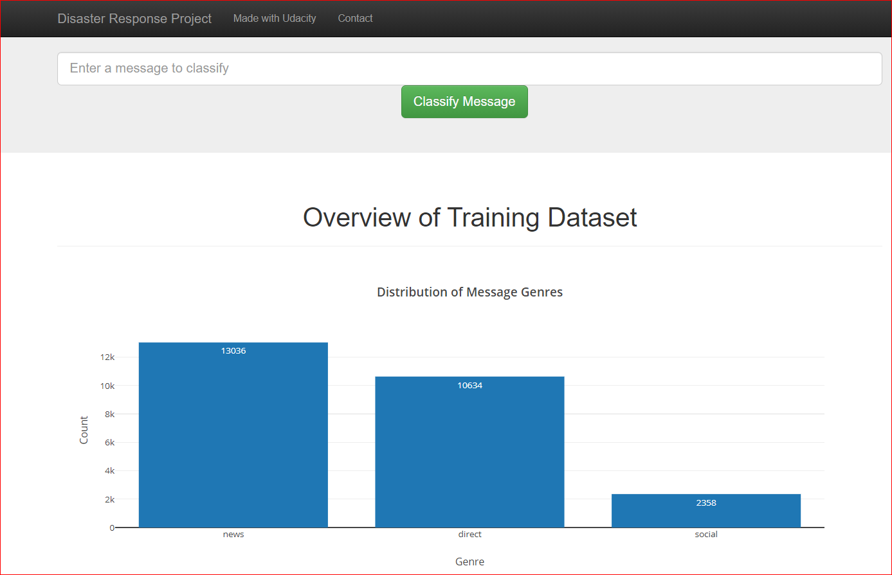
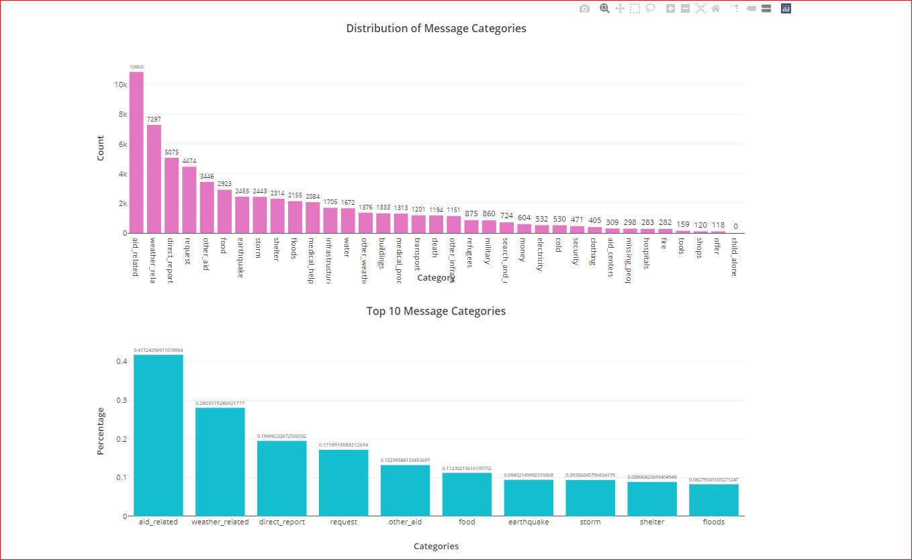
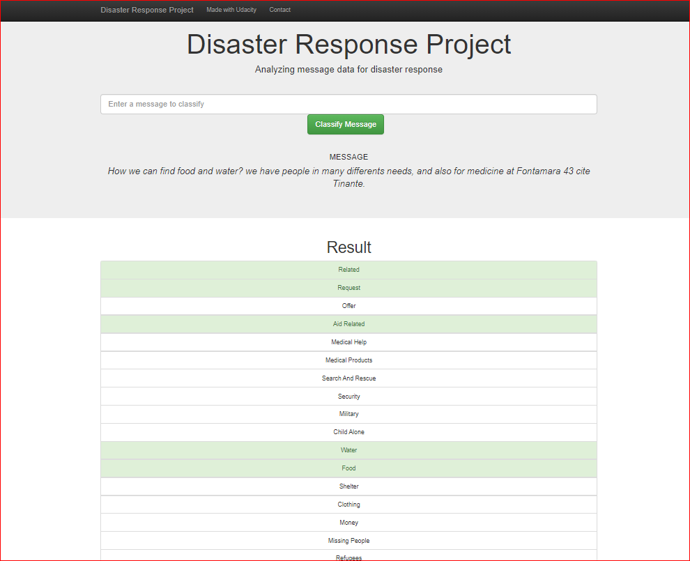
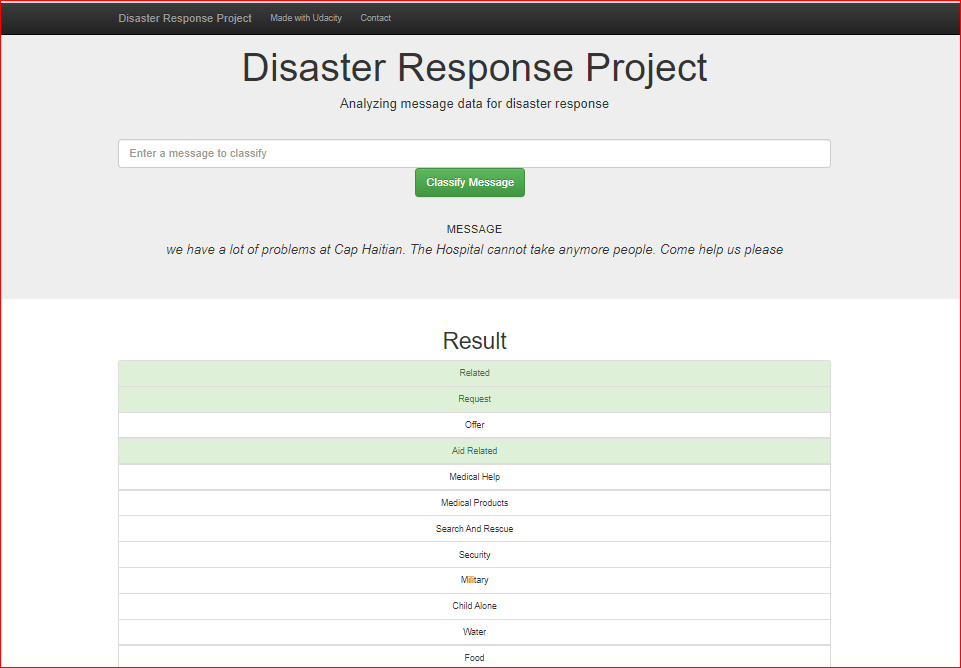
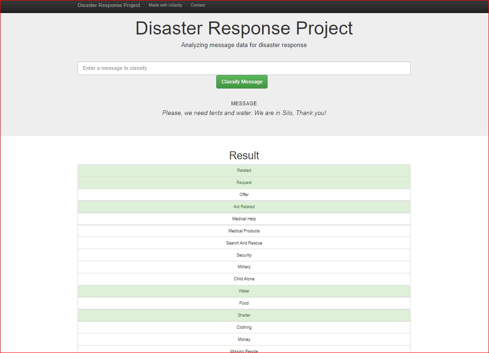

# Data-Scientist-Nanodegree-Program
By Marwan Saeed Alsharabbi

# Disaster Response Pipeline Project

## Table of Contents

- [Project Overview](#overview)
- [Instructions](#inst)
- [Project Components](#components)
  - [ETL Pipeline](#etl_pipeline)
  - [ML Pipeline](#ml_pipeline)
  - [Flask Web App](#flask)
- [Running](#run)
  - [Data Cleaning](#cleaning)
  - [Training Classifier](#training)
  - [Starting the Web App](#starting)
  - [Project Directory Structure](#Directory)
  

<a id='overview'></a>

## 1. Project Overview

 In this project, you'll apply these skills to analyze disaster data from Figure Eight to build a model for an API that classifies disaster messages.
In the Project Workspace, you'll find a data set containing real messages that were sent during disaster events. You will be creating a machine learning pipeline to categorize these events so that you can send the messages to an appropriate disaster relief agency.

Your project will include a web app where an emergency worker can input a new message and get classification results in several categories. The web app will also display visualizations of the data. This project will show off your software skills, including your ability to create basic data pipelines and write clean, organized code!

<a id='inst'></a>

### 2. Instructions
1. Run the following commands in the project's root directory to set up your database and model.
    
    - To run ETL pipeline that cleans data and stores in database
        `python data/process_data.py data/disaster_messages.csv data/disaster_categories.csv data/DisasterResponse.db`
    - To run ML pipeline that trains classifier and saves
        `python models/train_classifier.py data/DisasterResponse.db models/classifier.pkl`
     2. Run the following command in the app's directory to run your web app.
       - 'pip install -U scikit-learn scipy matplotlib'
       - `python run.py`

3. Go to http://0.0.0.0:3001/   

<a id='components'></a>

## 3. Project Components

There are three components of this project:

<a id='etl_pipeline'></a>

### 3.1. ETL Pipeline
In a Python script, process_data.py, write a data cleaning pipeline that:

- Loads the messages and categories datasets
- Merges the two datasets
- Cleans the data
- Stores it in a SQLite database

<a id='ml_pipeline'></a>

### 3.2. ML Pipeline
In a Python script, train_classifier.py, write a machine learning pipeline that:

- Loads data from the SQLite database
- Splits the dataset into training and test sets
- Builds a text processing and machine learning pipeline
- Trains and tunes a model using GridSearchCV
- Outputs results on the test set
- Exports the final model as a pickle file

<a id='flask'></a>

### 3.3. Flask Web App
For this part, you'll need to:

- Modify file paths for database and model as needed
- Add data visualizations using Plotly in the web app. 

<a id='run'></a>

## 4. Running

There are three steps to get up and runnning with the web app if you want to start from ETL process.


<a id='cleaning'></a>

### 4.1. Data Cleaning

**Go to the project directory** and the run the following command:

To run ETL pipeline that cleans data and stores in database python data/process_data.py data/disaster_messages.csv data/disaster_categories.csv data/DisasterResponse.db
 
 `python data/process_data.py data/disaster_messages.csv data/disaster_categories.csv data/DisasterResponse.db`

 <a id='training'></a>

### 4.2. Training Classifier
**Go to the project directory** and the run the following command:
- To run ML pipeline that trains classifier and saves

        `python models/train_classifier.py data/DisasterResponse.db models/classifier.pkl`
       
        
<a id='starting'></a>

### 4.3. Starting the web app

2. Run the following command in the app's directory to run your web app.

    - pip install -U scikit-learn scipy matplotlib
    - `python run.py`

3. Go to http://0.0.0.0:3001/











<a id='Directory'></a>

### 5. Project Directory Structure
```bash
C:.
│   README.md
│
├───app
│   │   run.py
│   │
│   └───templates
│           go.html
│           master.html
│
├───data
│       DisasterResponse.db
│       disaster_categories.csv
│       disaster_messages.csv
│       process_data.py
│
├───models
│       classifier.pkl
│       train_classifier.py
│
└───Screenshots
        Capture.PNG
        Capture1.PNG
        Capture2.PNG
        Capture3.PNG
        Capture4.PNG

